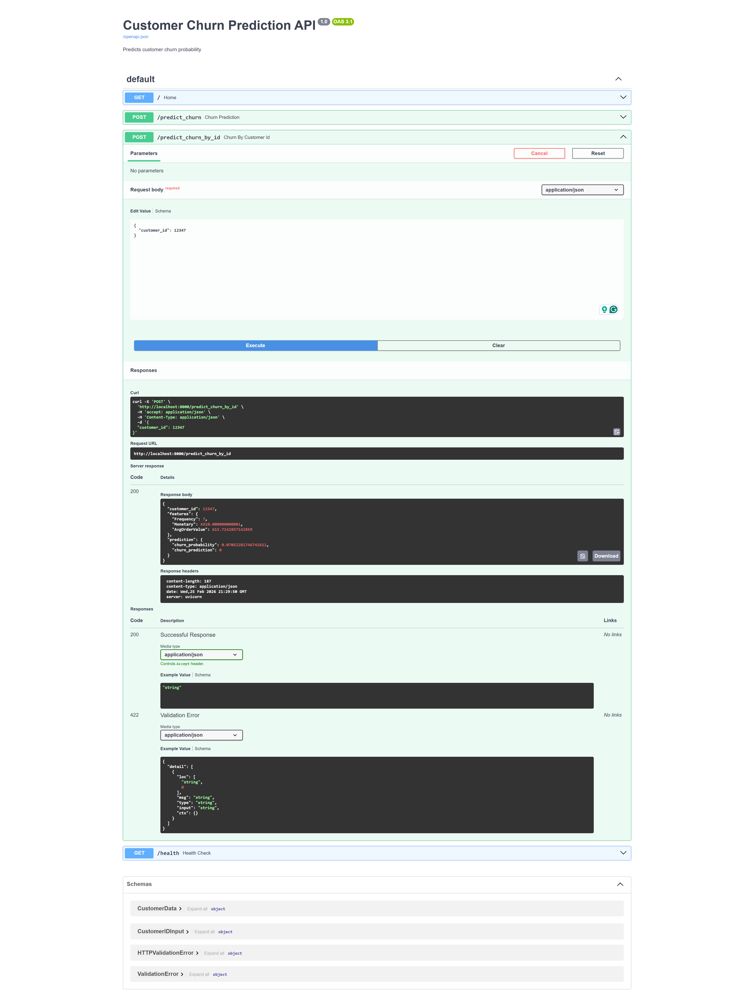

# 🧠 Customer Churn Prediction System — End-to-End Production ML Pipeline

A production-grade Machine Learning system that performs:

- 📊 Customer Segmentation (RFM + KMeans)
- 🔍 Churn Prediction (Logistic Regression)
- 🗄 MongoDB Data Storage
- ⚡ FastAPI Inference API
- 🐳 Fully Dockerized Deployment

Built with industry-level architecture and MLOps best practices.

## 💡 Why This Project Stands Out

Unlike typical ML notebooks, this project demonstrates:

- Production-grade API deployment
- Docker containerization
- MongoDB integration
- Proper separation of ingestion and inference
- Model version pinning
- Health check endpoints
- Clean Git hygiene

---

## 🚀 Project Overview

This project analyzes retail transaction data to:

1. Segment customers using RFM analysis
2. Predict churn probability using a trained ML model
3. Serve real-time predictions through a FastAPI REST API
4. Store and retrieve customer data from MongoDB
5. Run entirely inside Docker containers

---

## 🏗 Architecture

```
Raw CSV (One-time ingestion)
        ↓
MongoDB (Docker Container)
        ↓
FastAPI (Docker Container)
        ↓
Churn Prediction Model
```

## 📸 API Preview

Swagger Documentation:



### Services

- **FastAPI** – REST API for predictions
- **MongoDB** – Customer data storage
- **Docker Compose** – Multi-container orchestration
- **Scikit-learn** – ML modeling
- **Pandas** – Data processing

---

## 📂 Project Structure

```
customer-segmentation-retention/
│
├── app/
│   └── main.py              # FastAPI app
│
├── src/
│   ├── insert_data.py       # One-time MongoDB seeding
│   ├── config.py
│   └── logger.py
│
├── models/
│   ├── logistic_model.pkl
│   └── scaler.pkl
│
├── data/
│   └── raw/online_retail.csv
│
├── Dockerfile
├── docker-compose.yml
├── requirements.txt
└── README.md
```

---

## 📊 Machine Learning Pipeline

### 1️⃣ Customer Segmentation
- RFM feature engineering
- Log transformation
- KMeans clustering
- Silhouette score validation

### 2️⃣ Churn Modeling
- Logistic Regression
- Threshold tuning
- ROC-AUC evaluation
- Feature importance analysis
- Leakage detection & correction

Final model trained using:
- Frequency
- Monetary
- AvgOrderValue

---

## 🧪 Model Performance

| Metric | Score |
|--------|-------|
| Accuracy | ~74% |
| ROC-AUC | ~0.77 |
| Churn Recall (after tuning) | 0.82 |

---

## 🐳 Running with Docker

### 1️⃣ Build & Start Containers

```bash
docker compose build --no-cache
docker compose up
```

### 2️⃣ Seed MongoDB (One-time)

```bash
docker exec -it churn-api python -m src.insert_data
```

### 3️⃣ Access API

Swagger UI:
```
http://localhost:8000/docs
```

Health Check:
```
http://localhost:8000/health
```

---

## 📡 Example API Request

```json
POST /predict
{
  "customer_id": 12347
}
```

Response:

```json
{
  "customer_id": 12347,
  "churn_probability": 0.07,
  "churn_prediction": 0
}
```

---

## 🧠 MLOps & Engineering Practices Applied

- Environment version pinning
- Docker multi-container architecture
- Logging system
- Health check endpoint
- Separation of ingestion & inference
- Prevention of data leakage
- Proper Python module execution
- Clean Git hygiene

---

## 🔐 Reproducibility

All dependencies are pinned in:

```
requirements.txt
```

Docker ensures consistent execution across environments.

---

## 🌩 Future Improvements

- Deploy to AWS EC2
- Add monitoring & metrics
- Add CI/CD pipeline
- Add model retraining workflow
- Add authentication layer

---

## 👨‍💻 Author

Abhik Das  
Data Science | Machine Learning | MLOps  

---
